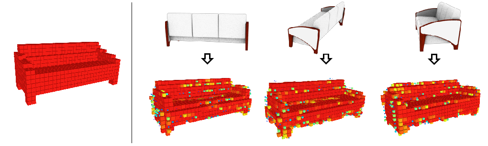

This project is a part of my bachelor degree paper,  and it is an implementation adapted from the network architecture in  [Learning a Predictable and Generative Vector Representation for Objects](https://arxiv.org/abs/1603.08637).

#### Usage

please download the pretrained [Resnet50v2](https://github.com/tensorflow/models/tree/master/research/slim#Pretrained) model of slim, and put it into resnet_v2_50 folder.

The data used in training is downloaded from [Github:lsm](https://github.com/akar43/lsm), download it and put it into data folder. data/split.json includes the information about train and test dataset. cls_info includes the information about the classid and classname.

##### train model

```
python3 train.py -c [class id] -g [gpu id] -i [batch_size]
```

##### train model on multi gpus

```
python3 train.py -c [class id] -g [gpu id] -i [img per gpu]
#example: train the class bench with batch size 60 on 4 gpus
python3 train.py -c 02828884 -g 0123 -i 15
```

#### Network Architecture


#### Results





##### ......

